# Project Overview
The **Online Car Rent** system is a simple website that helps people rent cars for different needs. It makes it easy for customers to find cars and for admins to manage the business.

# Project Collaborator
- @afnanhossain08
- @AhmadZubayer
- @siamshammo
- @tabassumshifa

# Project Description
This project is built to make car renting easy. There are two types of users:
- **Admin**: The person who manages the cars, sees all orders, and can delete members or blog posts.
- **Member**: A registered user who can look for cars, rent them, see their history, and write about their experience in a blog.

# Features and Project Screenshots

### 1. User Authentication & Profile (Done by @afnanhossain08)
- Users can sign up and log in as either an Admin or a Member.
- Members can update their profile information and upload a profile picture.
- **Screenshots:**
  - **Sign In:**
    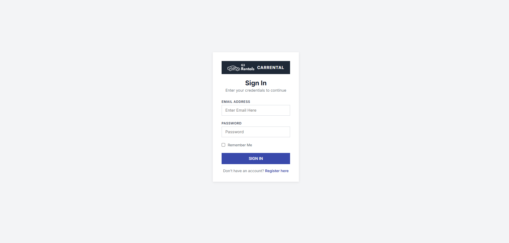
  - **Sign Up:**
    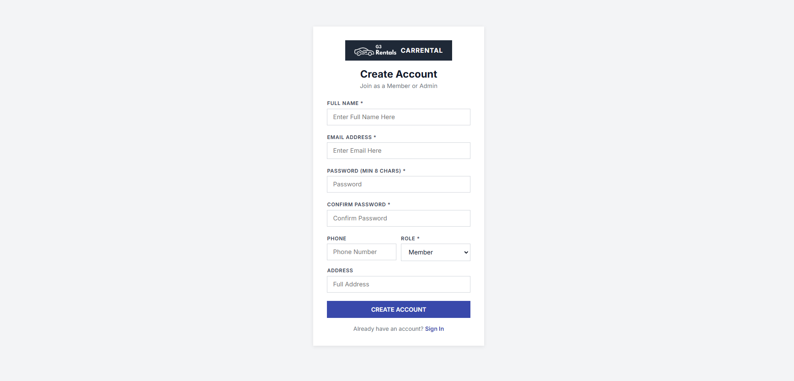
  - **Profile Management:**
    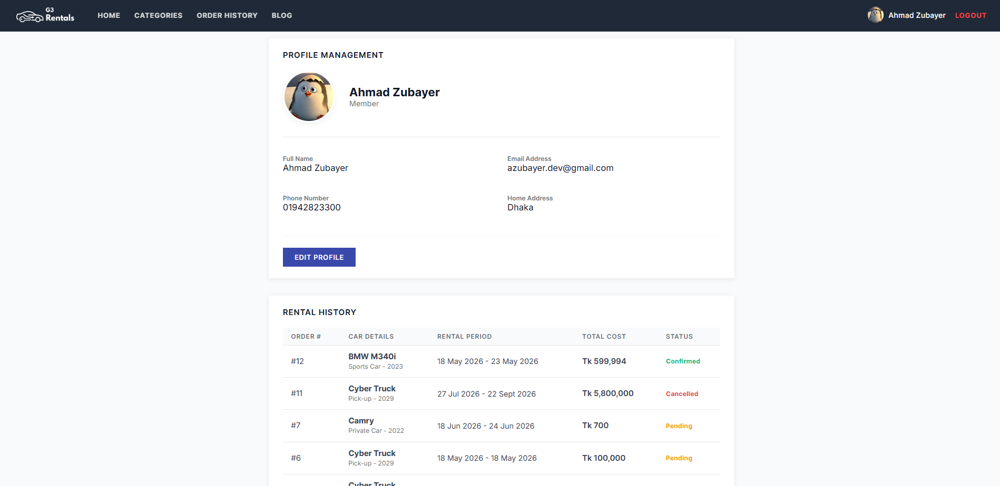
  - **Edit Profile:**
    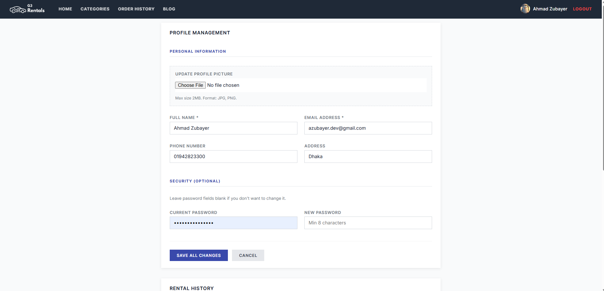

### 2. Admin Management (Done by @AhmadZubayer)
- A dashboard to see total cars, members, and orders.
- Admins can add, edit, or delete cars from the list.
- Admins can manage members and see the history of all car rentals.
- **Screenshots:**
  - **Admin Dashboard:**
    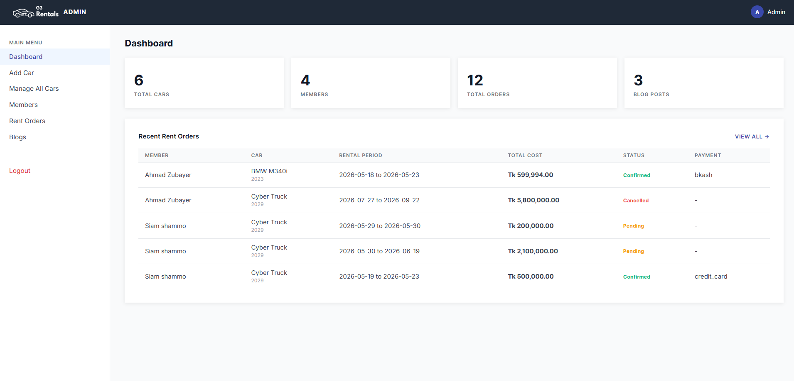
  - **Car Management:**
    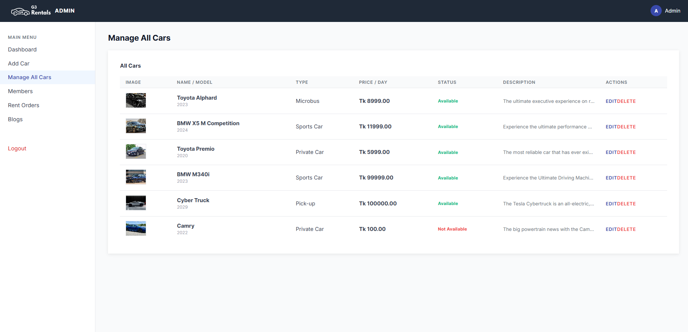
  - **Member Management:**
    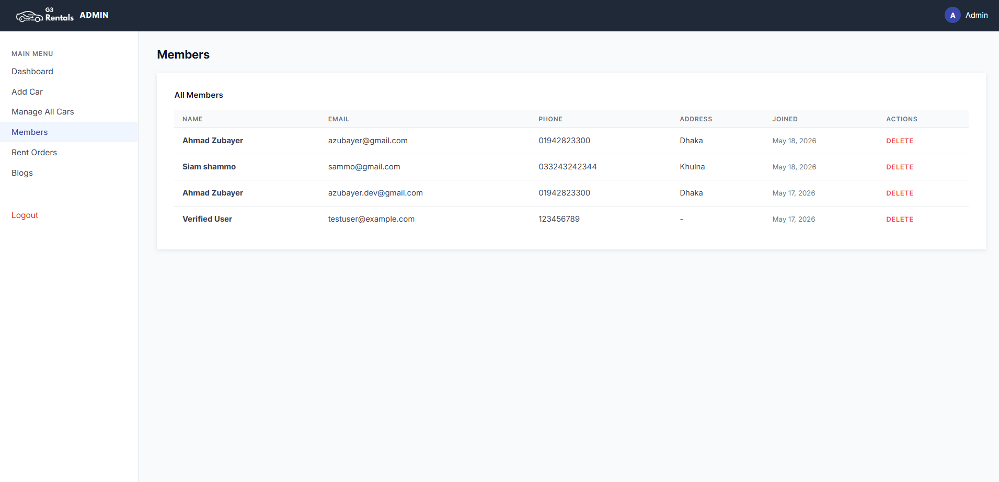
  - **Rental History:**
    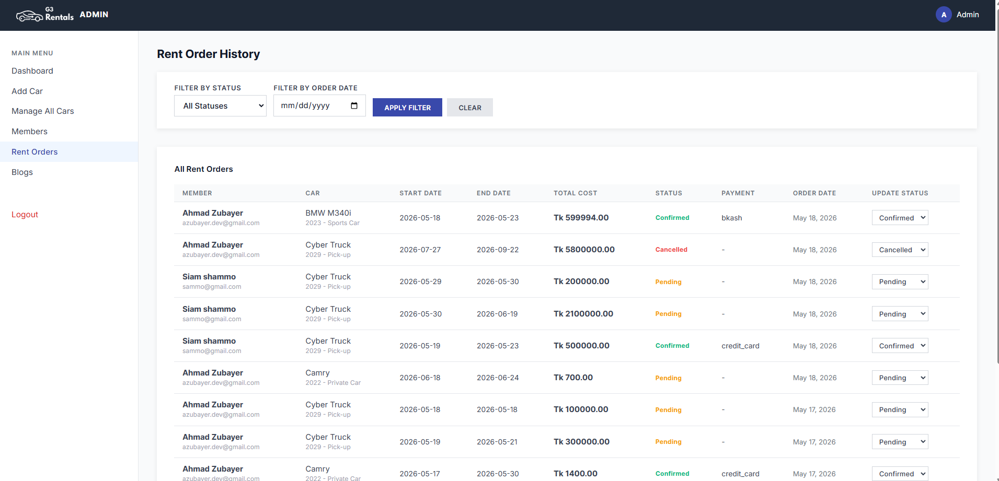

### 3. Car Selection & Renting (Done by @siamshammo)
- Members can see featured cars on the home page and browse cars by type.
- Members can pick a car, choose dates, and see the total cost.
- After ordering, an invoice is shown where they can pay or cancel.
- **Screenshots:**
  - **Featured Cars:**
    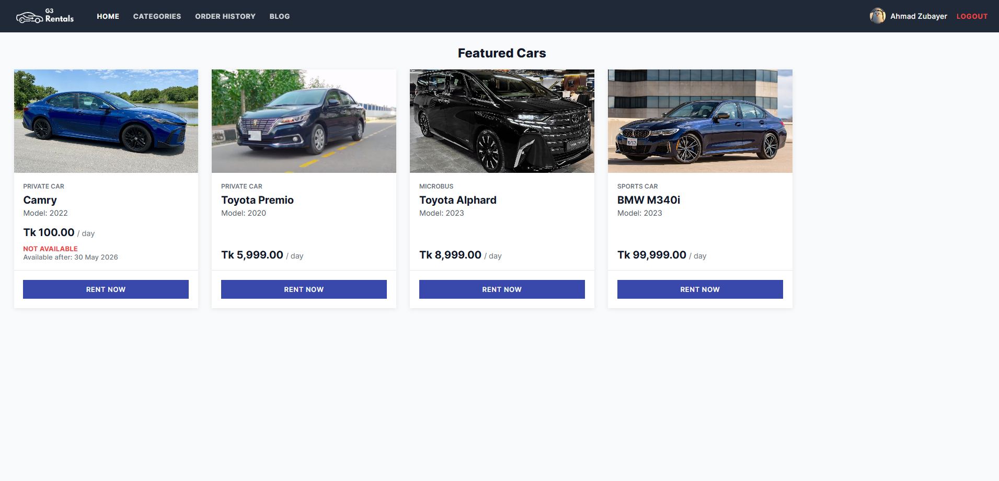
  - **All Cars:**
    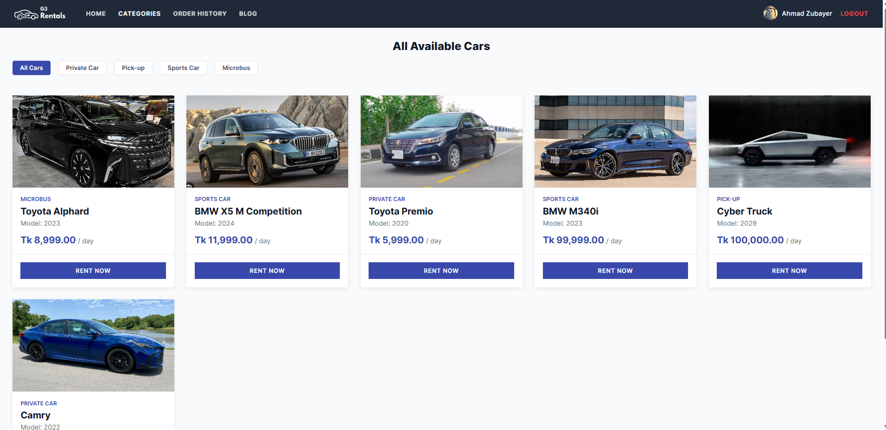
  - **Rent Date Selection:**
    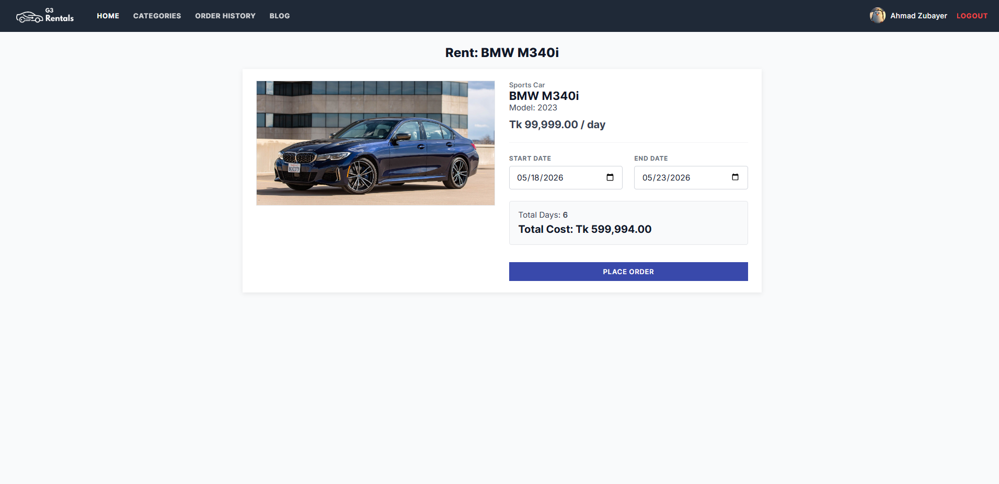
  - **Invoice:**
    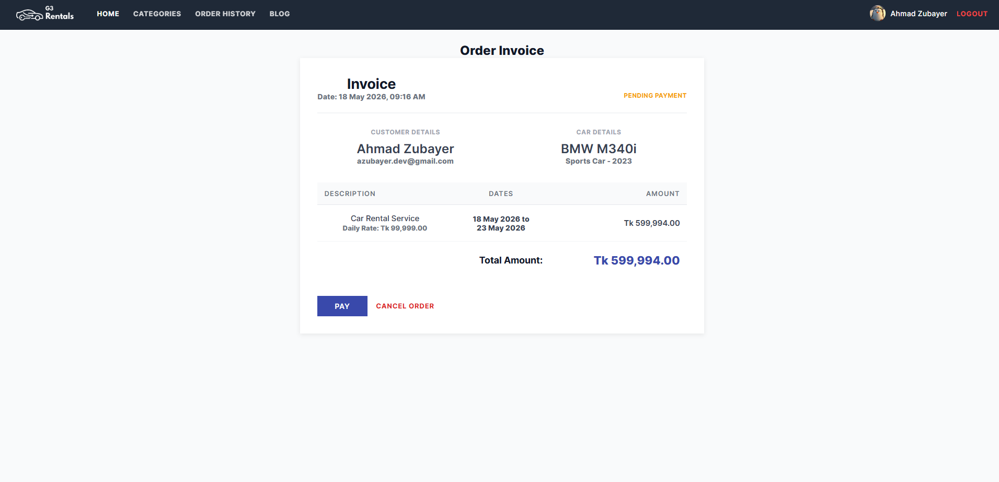
  - **Payment Success:**
    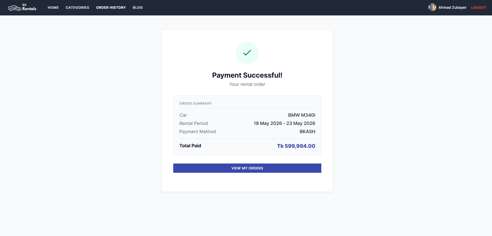

### 4. Blog Page (Done by @tabassumshifa)
- Members can post about their car rental experience.
- Everyone can see the blogs, and Admins can delete any post if needed.
- **Screenshots:**
  - **Blog List:**
    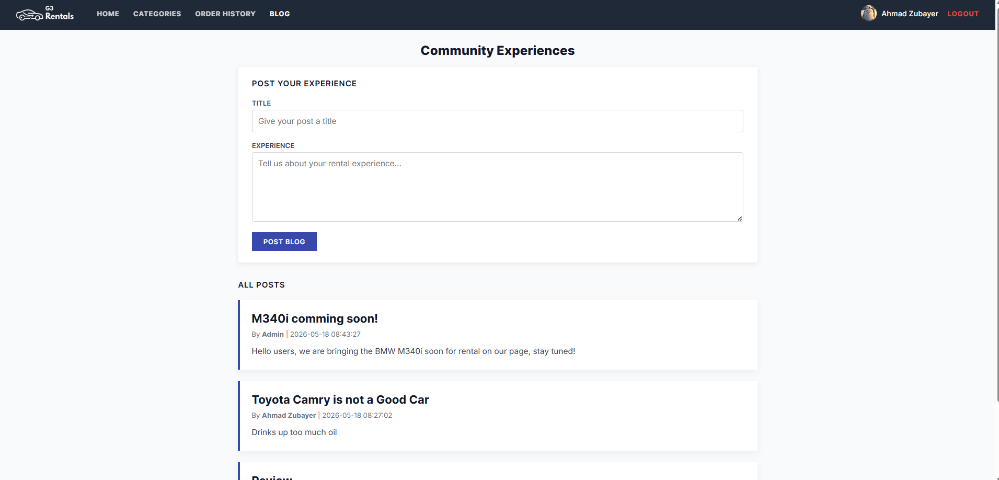
  - **Admin Blog Control:**
    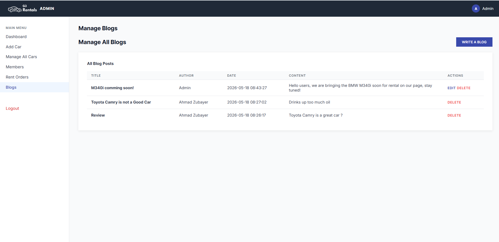

# Technologies Used
- **Frontend**: HTML, CSS, and JavaScript.
- **Backend**: PHP using the MVC pattern.
- **Database**: MySQL for storing all information.
- **Communication**: AJAX and JSON for smooth updates without reloading pages.

# System Architecture / MVC Diagram
The project uses the **MVC (Model-View-Controller)** way of organizing code:
- **Model**: Talks to the database.
- **View**: What the user sees (HTML/CSS).
- **Controller**: The "brain" that connects the Model and View.

# Database Schema
The database is called `car_rental_db` and has these tables:
- `users`: Stores names, emails, and passwords.
- `cars`: Stores car details like name, type, and price.
- `orders`: Stores rental requests.
- `payments`: Stores payment information.
- `rentals`: Stores the history of confirmed rents.
- `blogs`: Stores the blog posts written by users.

# Conclusion & Future Work
This project is a complete basic car rental system. In the future, we could add:
- A search bar to find cars faster.
- More payment options like mobile banking.
- A rating system for cars.
- Automatic email receipts.
